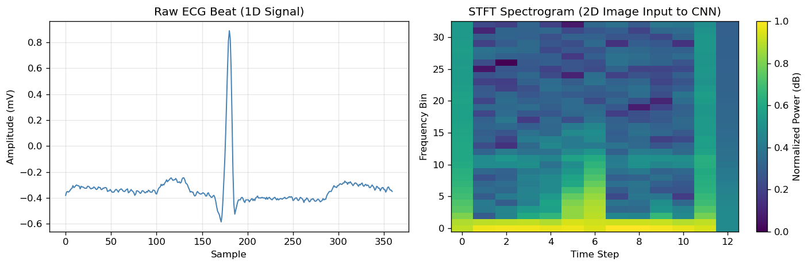
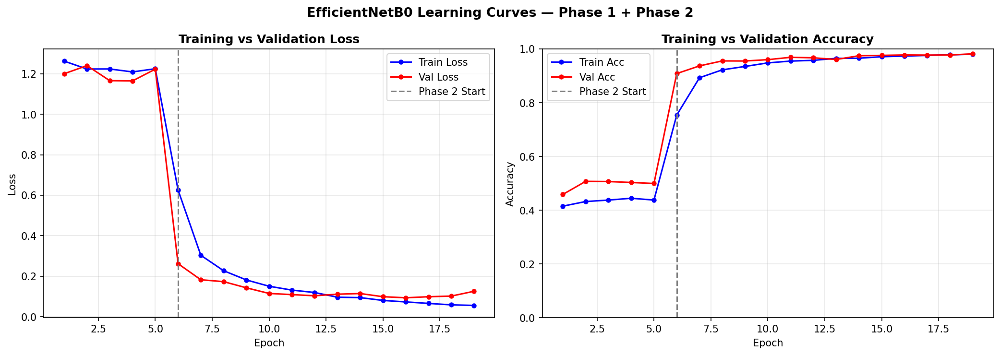
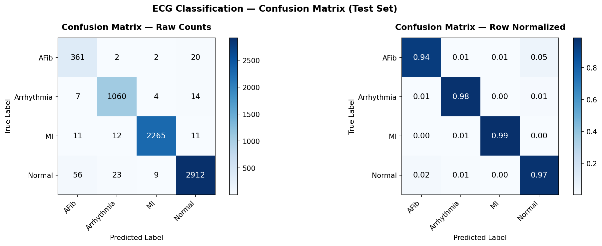
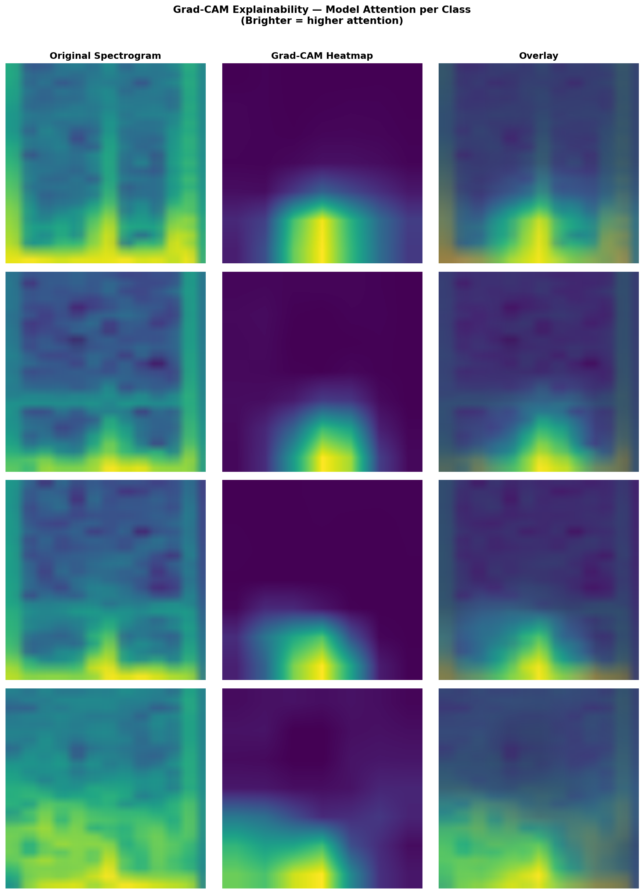

# ECG Arrhythmia Classification via Deep Learning

> A polished end-to-end ECG classification project that converts MIT-BIH cardiac signals into spectrogram images and classifies them using EfficientNetB0.
>
> Deep Learning for Computer Vision.

## Project Summary

This repository implements a complete ECG classification pipeline:
- raw ECG download and beat segmentation from the MIT-BIH Arrhythmia Database
- conversion of 1D beats into STFT spectrogram images
- transfer learning with EfficientNetB0
- two-phase training and evaluation
- explainability using Grad-CAM

### Key results

| Metric | Result |
|---|---|
| Test Accuracy | **97.47%** |
| Macro F1 Score | **0.9548** |
| Best Validation Loss | **0.0933** |
| Classes | `Normal`, `Arrhythmia`, `AFib`, `MI` |
| Dataset | MIT-BIH Arrhythmia Database |

---

## Table of Contents

- [Overview](#overview)
- [Dataset & Labels](#dataset--labels)
- [Architecture & Workflow](#architecture--workflow)
- [Results](#results)
- [Repository Structure](#repository-structure)
- [Setup](#setup)
- [Usage](#usage)
- [Design Decisions](#design-decisions)
- [Limitations](#limitations)
- [Future Work](#future-work)
- [References](#references)

---

## Overview

### Problem

Manual ECG interpretation is time-consuming and requires specialist expertise. This project aims to automate beat-level ECG classification using deep learning, reducing the burden on clinicians and enabling rapid screening.

### Solution

The system treats ECG analysis as a computer vision problem by converting each heartbeat into a spectrogram image. A pretrained EfficientNetB0 model learns the visual patterns associated with four ECG classes.

### Why this approach?

- Spectrograms capture both temporal and frequency structure.
- Transfer learning leverages pretrained visual features.
- The pipeline is reproducible and suitable for academic presentation.

---

## Dataset & Labels

### MIT-BIH Arrhythmia Database

This project uses the MIT-BIH Arrhythmia Database, a benchmark dataset widely used in ECG research.

| Property | Value |
|---|---|
| Records | 48 half-hour ECG recordings |
| Sampling rate | 360 Hz |
| Lead used | Lead I |
| Files | `.dat`, `.hea`, `.atr` |
| Approx. size | 100 MB |
| Annotated beats | ~110,000 |

### Target classes

| Class | MIT-BIH symbols | Clinical meaning |
|---|---|---|
| `Normal` | N | Sinus rhythm |
| `Arrhythmia` | V, E | Ventricular ectopic beats |
| `AFib` | A, S, e | Atrial fibrillation / supraventricular beats |
| `MI` | L, R | Bundle branch block proxy for MI-related conduction abnormalities |

> Note: MI labels are a research proxy using L/R bundle branch block beats, because MIT-BIH does not include explicit myocardial infarction labels.

### Class distribution

| Class | Approx. samples | Percentage |
|---|---|---|
| Normal | 75,000 | 74.9% |
| Arrhythmia | 7,000 | 7.0% |
| MI | 8,000 | 8.0% |
| AFib | 2,600 | 2.6% |

The dataset is highly imbalanced, so training uses class weighting and careful splitting.

---

## Architecture & Workflow

### Workflow diagram

```text
Raw ECG signal
    ├─> Beat segmentation
    ├─> STFT spectrogram generation
    ├─> Image dataset assembly
    ├─> EfficientNetB0 transfer learning
    └─> Evaluation + explainability
```

### Target classes

| Class | MIT-BIH symbols | Clinical meaning |
|---|---|---|
| `Normal` | N | Sinus rhythm |
| `Arrhythmia` | V, E | Ventricular ectopic beats |
| `AFib` | A, S, e | Atrial fibrillation / supraventricular beats |
| `MI` | L, R | Bundle branch block proxy for MI-related conduction abnormalities |

> Note: MI labels are a research proxy using L/R bundle branch block beats, because MIT-BIH does not include explicit myocardial infarction labels.

### Class distribution

| Class | Approx. samples | Percentage |
|---|---|---|
| Normal | 75,000 | 74.9% |
| Arrhythmia | 7,000 | 7.0% |
| MI | 8,000 | 8.0% |
| AFib | 2,600 | 2.6% |

The dataset is highly imbalanced, so training uses class weighting and careful splitting.

---

## Architecture & Workflow

### Workflow diagram

```text
Raw ECG signal
    ├─> Beat segmentation
    ├─> STFT spectrogram generation
    ├─> Image dataset assembly
    ├─> EfficientNetB0 transfer learning
    └─> Evaluation + explainability
```

### Pipeline stages

1. **Data download**
2. **Beat extraction** (360-sample windows around each R-peak)
3. **STFT conversion** to 2D spectrograms
4. **Dataset creation** with class balancing and augmentations
5. **Model training** in two phases
6. **Evaluation** with metrics, confusion matrix, and Grad-CAM



### Model architecture

- Base model: EfficientNetB0 pretrained on ImageNet
- Custom head: dropout + fully connected layer to 4 classes
- Input: 224×224 RGB image
- Loss: Class-weighted cross-entropy
- Optimizer: Adam
- Scheduler: ReduceLROnPlateau



---

## Results

### Performance summary

| Metric | Value |
|---|---|
| Test Accuracy | 97.47% |
| Macro F1 | 0.9548 |
| Best validation loss | 0.0933 |
| AFib F1 | 0.8805 |
| MI F1 | 0.9893 |

### Classification report

| Class | Precision | Recall | F1 |
|---|---|---|---|
| Normal | 0.9848 | 0.9707 | 0.9777 |
| Arrhythmia | 0.9812 | 0.9621 | 0.9716 |
| AFib | 0.8299 | 0.9377 | 0.8805 |
| MI | 0.9934 | 0.9852 | 0.9893 |

### Confusion matrix



### Explainability

Grad-CAM maps demonstrate that the model attends to the central frequency-time region of each beat, indicating clinically relevant focus.



---

## Repository Structure

| Path | Description |
|---|---|
| `ECG_Local_VS_Code.ipynb` | Main notebook for data processing, training, and evaluation |
| `app.py` | Optional script or demo driver |
| `ecg_project/mitdb/` | Raw MIT-BIH ECG files |
| `ecg_project/ecg_spectrograms/` | Generated spectrogram images by class |
| `ecg_project/checkpoints/` | Saved model weights |
| `ecg_project/outputs/` | Plots, reports, and visual artifacts |

---

## Setup

### Prerequisites
- Python 3.8+
- `pip`
- macOS, Linux, or Windows

### Install dependencies

```bash
pip install wfdb torch torchvision scipy matplotlib scikit-learn tqdm opencv-python-headless
```

### Environment check

```python
import torch
print(torch.__version__)
print('CUDA available:', torch.cuda.is_available())
```

> macOS note: Data loaders use `num_workers=0` for compatibility. On Linux/Windows, increasing `num_workers` improves speed.

---

## Usage

### Running the project

1. Open `ECG_Local_VS_Code.ipynb` in Jupyter or VS Code.
2. Run cells sequentially from top to bottom.
3. Confirm `ecg_project/mitdb/` contains downloaded records before generating spectrograms.
4. Train Phase 1, then Phase 2, then evaluate.

### Estimated timings

| Step | Section | CPU time |
|---|---|---|
| Download MIT-BIH | Data acquisition | 2–5 min |
| Generate spectrograms | Preprocessing | 15–25 min |
| Phase 1 training | Transfer learning head | ~1 hr |
| Phase 2 training | Full fine-tuning | 2–3 hrs |
| Evaluation | Metrics + visuals | ~10 min |

### Resuming work

If the run is interrupted, reload the latest checkpoint from `ecg_project/checkpoints/ecg_best_model.pth` and continue from the next notebook cell. Spectrogram generation is safe to re-run because completed images are skipped.

---

## Design Decisions

### Why spectrograms?
STFT spectrograms reveal time-frequency features of ECG beats and enable the use of strong 2D convolutional backbones.

### Why transfer learning?
Transfer learning reduces the amount of ECG-specific labeled data required and is effective for this visual representation.

### Why two-phase training?
Phase 1 stabilizes the classification head, while Phase 2 fine-tunes the full network with a lower learning rate.

### Why weighted loss?
Weighted loss compensates for class imbalance without generating synthetic samples.

---

## Limitations

- MI class is a proxy using bundle branch block beats rather than explicit MI labels.
- Single-lead ECG input limits clinical richness compared to 12-lead models.
- Training uses CPU by default; GPU usage requires updating the device and worker settings.
- The model is trained on MIT-BIH only and needs external validation for broader generalization.
- STFT images are low resolution and upsampled for EfficientNet input.

---

## Future Work

- Add multi-lead ECG input
- Experiment with EfficientNetB2/B4 on GPU
- Test wavelet or mel-spectrogram preprocessing
- Add ROC and calibration plots
- Export the model to ONNX
- Deploy via FastAPI for live ECG inference

---

## References

- Moody, G.B. and Mark, R.G. (2001). [The impact of the MIT-BIH Arrhythmia Database](https://physionet.org/content/mitdb/1.0.0/).
- Tan, M. and Le, Q.V. (2019). [EfficientNet: Rethinking Model Scaling for Convolutional Neural Networks](https://arxiv.org/abs/1905.11946).
- Selvaraju, R.R. et al. (2017). [Grad-CAM: Visual Explanations from Deep Networks via Gradient-based Localization](https://arxiv.org/abs/1610.02391).
- PhysioNet: [MIT-BIH Arrhythmia Database](https://physionet.org/content/mitdb/1.0.0/)

---

## License

This repository is intended for academic and research use. To add a formal license, create a `LICENSE` file with your chosen terms.
